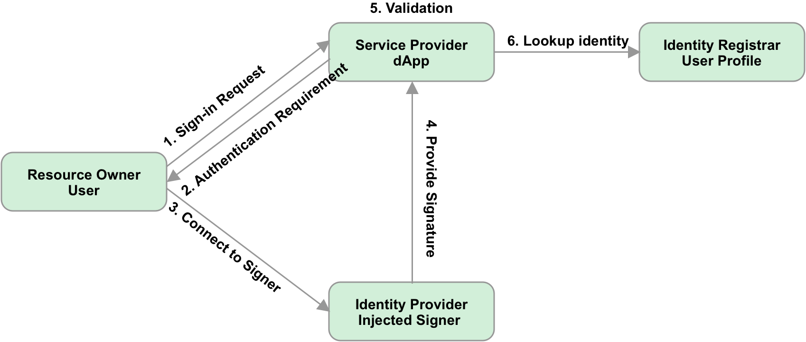

# Standard Proposal and workflow for Polkadot Sign In

- **PSP Number:**
- **Authors:** hanwencheng (hanwen@litentry.com)
- **Status:** Draft
- **Created:** 2021-11-20
- **Reference Implementation:** https://github.com/litentry/PolkaSignIn (WIP)

## Summary

A standard for the workflow about OAuth based on Polkadot accounts. It describes how to integrate Polkadot accounts with multiple applications including dApps and traditional Web2 world.

This proposal aims to define the standard interface and workflow for the click-once signin action.

## Motivation

Currently, while there is no standard , every dApps will have different signin action.

In a Web2 world, When signing in to popular non-blockchain services today, users will typically use identity providers (IdPs) that are centralized entities with ultimate control over users' identifiers, for example, large internet companies and email providers. Incentives are often misaligned between these parties.

Sign-In with Polkadot offers a new self-custodial option for users who wish to assume more control and responsibility over their own digital identity.

In Web3, injected signers are widely used for connecting accounts with dApps. Already, many services support workflows to authenticate Polkadot accounts using message signing, such as to establish a cookie-based web session which can manage privileged metadata about the authenticating address.

This is an opportunity to standardize the sign-in workflow and improve interoperability across existing services, while also providing wallet vendors a reliable method to identify signing requests as Sign-In with Polkadot requests for improved UX.

## Specification

### Workflow

Sign-In with Polkadot works as follows:

1. The client sends the sign-in request **SignIn-Message** to the target service.

2. The target service will return the information named as **Challenge-Message**.

3. The client connects to Injected Signer(Injected Signer like : Polkadot.js Extension, Metamask, Parity Signer ...).

4. The Injected Signer will display the UI to show challenge message detail to notice client.

5. (If confirmed by step 4) The Injected Signer will sign the message as **Signed-Message** and return it to client.

6. The client sends **Signed-Message** to the target service.

7. The target service validates the **Signed-Message**. If success, the target service should return the identity info to the client. The identity info SHOULD contain the token or session info so that the client can interaction with server later.

8. The target service may further fetch data associated with the Polkadot address, such as from the Polkadot blockchain (e.g., PNS, Parachain), or other data sources that may or may not be permissioned.

 

#

### Message Template

A JSON template of the full message is presented below for readability and ease of understanding. Field descriptions are provided in the following section.

#### SignIn-Message

```
{
    "identityNetwork": "${network}"
}
```

##### Sample message:

```
{
    "identityNetwork": "polkadot"
}
```

#### Challenge-Message

```
{
    "identityNetwork": "${network}"
    "callbackEndpoint": "${callbackEndpoint}",
    "scope": [${scope}],
    "challenge": "${challenge}"
}
```

##### Sample message:

```
{
    "identityNetwork": "polkadot",
    "callbackEndpoint": "http://dapp.com/sign-in/callback",
    "scope": ["address","balance"],
    "challenge": "challenge message at 20210-11-21 10:00:00"
}
```

#### Signed-Message

```
{
    "identityNetwork": "${network}"
    "scope": [${scope}],
    "challenge": "${challenge}",
    "signature": "${signature}",
    "address": "${address}",
}
```

##### Sample message:

```
{
    "identityNetwork": "polkadot",
    "scope": ["address","balance"],
    "challenge": "challenge message at 20210-11-21 10:00:00",
    "signature": "0x58baf5e0cca04d71646662aeac8ab3254193a7fff86344dbf11d1addce996768136f3a5b08381299f99b972d6a0f5fed26c65ccca97f9ceeccea61449e4f9281",
    "address": "5GsNYEXtBfGBN4buJEqRtGtonJkgq8Uo2dex3zqLcnwwfy3n",
}

```

### Message Field Descriptions

- `identityNetwork` is network name, the payload is required since each chain may has its own algorithmic mechanism. the network name should be the official name known by the wallet and server-side.

- `callbackEndpoint` is a url path, the **Signed-Message** will be sent to the path.

- `scope` is used to require the access privilege for user's account resource.It is a list of information that user wishes to have resolved as part of authentication.

- `challenge` is simple text from server-side , contains some unique information to indicate the current sign-in request.

- `signature` is the value signed by Injected Signer with challenge and account address.

- `address` is the account address which connected to the Injected Signer.

#

### Resolving external identity Data

- The server or wallet MAY additionally perform resolution of identity data, as this can improve the user experience by displaying a human-friendly information that is related to the `address`. Resolvable identity data include:
  - Identity related-information in identity pallet
  - The [Polkadot Name System](https://www.pns.link/).
- If resolution of PNS data is performed, implementers SHOULD take precautions to preserve user privacy and consent, as their `address` could be forwarded to third party services as part of the resolution process.

#

### Wallet Implementer Guidelines

#### Display `Challenge-Message`

- Wallet implementers MUST display the full `Challenge-Message` to the user.
- Must request confirmation by user.

#### Sign to `Signed-Message`

- Wallet implementers MUST support sign the challenge message with account address, return the signed message.

#### Supporting internationalization (i18n)

- After successfully parsing the message, translation may happen at the UX level per human language.

#

### Server-Side Implementer Guidelines

#### Generate `Challenge-Message`

- The message MUST be generated for sign-in request by server-side， the challenge message MUST be included.

#### Support `Callback Endpoint`

- The callback endpoint MUST be supported by server-side to receive and verify the signed message.

#### Support verify `Signed-Message`

- The server-side MUST support the verification of the signed message.

#### Support return identity info

- The server-side MUST support the identity info to the client. The identity info SHOULD contain the token or session info so that the client can interaction with server later.

## Copyright

This PSP is placed in the [public domain](https://creativecommons.org/publicdomain/zero/1.0/).
